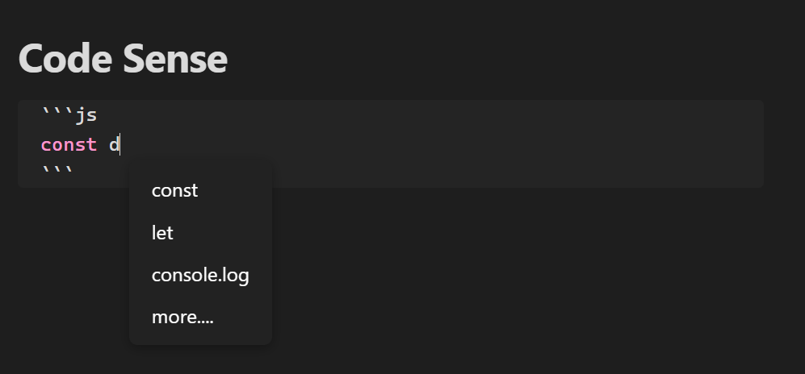

# CodeSense

**CodeSense** brings live IntelliSense-like functionality to your Obsidian code blocks — offering syntax highlighting, contextual suggestions, and semantic validation for JavaScript, TypeScript, and Dataview inline or fenced blocks.

---

## ✨ Features

- 🔍 **Live Suggestions:** Context-aware completions as you type (like IntelliSense).
- 🎨 **Syntax Highlighting:** Real-time coloring of JS, TS, and Dataview expressions.
- 🧠 **Semantic Checking:** Detect undeclared variables, invalid expressions, and more.
- 🧩 **Dataview Support:** Smart completions and highlighting within Dataview blocks.
- ⚡ **Zero-lag UI:** Efficient DOM placement with auto-adjusted popup positioning.
- 📦 **Non-intrusive:** No need to switch editors — everything works inline in Obsidian.

---

## 🧪 Languages to support (roadmap)

| Language    | Syntax Highlighting | IntelliSense | Semantic Checks |
|-------------|---------------------|--------------|-----------------|
| JavaScript  | 🚧 (working here)                | 🚧          | 🚧              |
| TypeScript  | 🚧                 | 🚧          | 🚧              |
| Dataview    | 🚧                 | 🚧 (partial)| 🚧 (partial)    |

---

## 📸 Example Preview

---

## 🚧 Project Status

> ⚠️ This project is in **early development**.  
> Expect bugs, incomplete features, and frequent changes. Contributions, ideas, and feedback are welcome!

---

## 🔧 Installation

> Manual installation for now:
1. Create an obsidian vault (if you don't have one already) for development porpuses.
2. Go to your obsidian folder (the vault)
3. Clone this repo inside plugins/ folder (create it if it doesn't exists)
4. Open obsidian and activate the plugin
